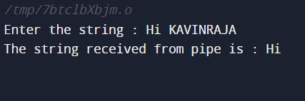

# OS-EX.6-IMPLEMENTATION-OF-INTER-PROCESS-COMMUNICATION-USING-PIPE

## AIM:
To implement interprocess communication using pipe command.
## ALGORITHM:
```
1.	Create a child process using fork().
2.	Create a simple pipe with C, we make use of the pipe() system call.
3.	Create two file descriptor fd[0] is set up for reading, fd[1] is set up for writing
4.	Close the read end of parent process using close() and perform write operation
5.	Close the write end of child process and perform reading
6.	Display the text.
```
## PROGRAM:
```c
#include <stdio.h>
int main()
{
  int fd[2],child; char a[10];
  printf("\nEnter the string : ");
  scanf("%s",a);
  pipe(fd);
  child=fork();
  if(!child)
{
    close(fd[0]);
    write(fd[1],a,5); wait(0);
}
  else
{
   close(fd[1]);
    read(fd[0],a,5); printf("The string received from pipe is : %s",a);
}
}
```
## OUTPUT:

## RESULT:
Thus the implementation of interprocess communication using pipe command is successfully executed.
